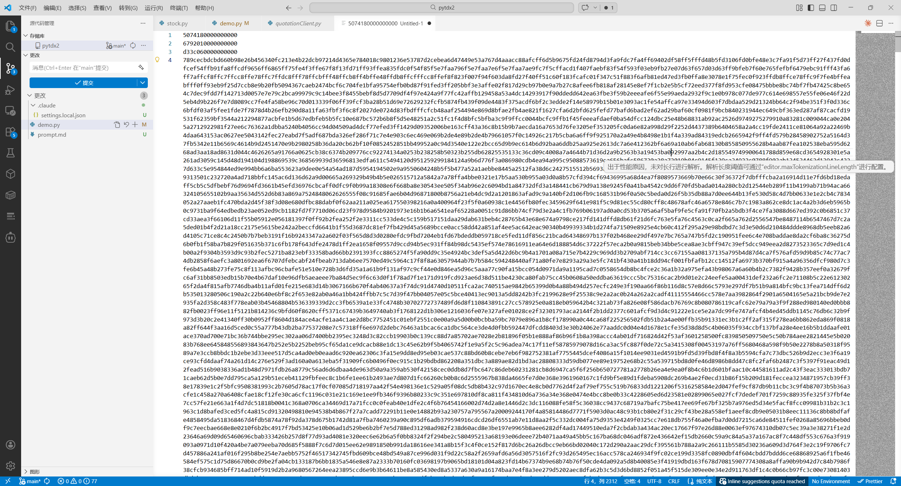

# FAQ

----

## 怎么分析的协议

1. 我用的[WireShark](https://github.com/wireshark/wireshark)

2. 筛选出客户端与服务器的通信数据后`追踪流`

用 `(tcp.dstport == 7709 || tcp.srcport == 7709) && data.len != 0 `(主行情服务器)

或`(tcp.dstport == 7727 || tcp.srcport == 7727) && data.len != 0 `(扩展行情服务器)

3. 接下来就是对着hex发呆了

其实也没什么神秘的，无非就是找规律

根据[baseStockClient](https://github.com/LisonEvf/pytdx2/blob/main/client/baseStockClient.py#L210)中的消息结构体，肉眼找到协议体

常见的就是float32或是long32或是int8和int16，唯眼熟而

当然，也会有[压缩过的值](https://github.com/LisonEvf/pytdx2/blob/main/utils/help.py#L26)直接大力全部送进去，这种压缩方式有个特性，虽然会解错，但总会有解对的，全部都成明文数字了，无非对着客户端找对的上的值，然后反复验证罢了

对于hex分析有更多兴趣的，可以找一找CTF教程

> 目前能用的协议基本上都已经整理完毕了，**分享出来仅供学习**

## 为什么用通达信的数据

无他，快，且可靠

而且大多券商用的也是这套协议

## 怎么获取复权因子、ETF、期货、美股等数据

目前只是整理了基础协议，进一步的便捷的封装还在持续梳理中，可以参考demo中的案例，多加尝试

## 这项目能干什么

学习，学习，还是学习

请不要将本项目作为数据源使用，不排除会有错漏

本项目会探索回测、MCP等领域,但是不会涉及level2和交易等增值内容

